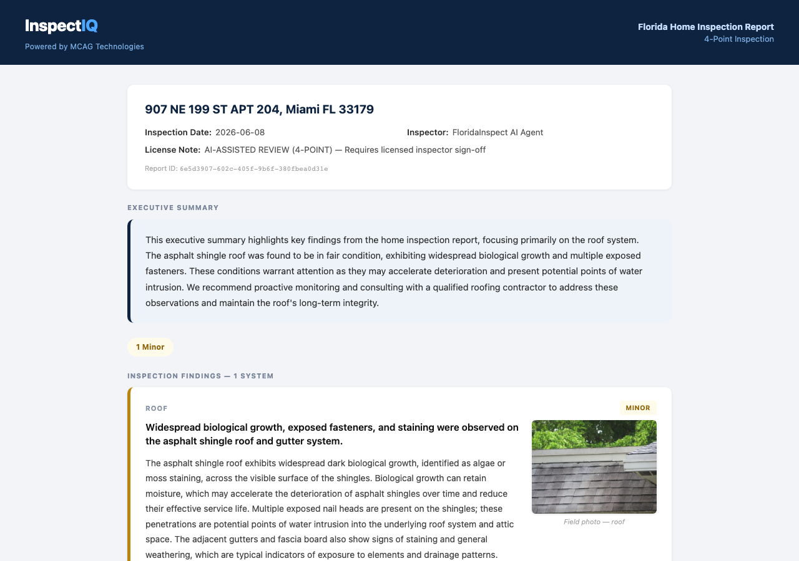

# InspectIQ — AI Inspection Agent

**Autonomous multi-agent AI pipeline that automates Florida home inspection reports — from field photo to regulatory-compliant narrative in minutes.**

[](https://inspectiq-agent-production.up.railway.app/health)
[](https://www.python.org/)
[](https://google.github.io/adk-docs/)
[](LICENSE)

---

## The Problem

Florida home inspectors face a reporting bottleneck that costs them hours per job:

- **2–3 hours** writing reports manually after every inspection
- **6+ clicks** per photo annotation in existing tools
- **Zero tools** that understand Florida-specific regulations automatically — inspectors must cross-reference FL Statute 468, Citizens insurance criteria, and Wind Mitigation standards by hand

InspectIQ eliminates that bottleneck entirely.

---

## How It Works

Three coordinated AI agents run in sequence via **Google ADK**:

```
Field Photo
    │
    ▼
┌─────────────────────────────────────────────┐
│  1. Capture Agent  (Gemini 2.0 Flash Vision) │
│     Photo → structured FindingDraft          │
│     system / severity / confidence           │
└───────────────────┬─────────────────────────┘
                    │
                    ▼
┌─────────────────────────────────────────────┐
│  2. Analyze Agent  (RAG + Gemini 1.5 Pro)    │
│     FindingDraft → RegulatoryCheck           │
│     FL Statute 468 · Citizens 4-Point ·      │
│     Wind Mitigation · DBPR                   │
└───────────────────┬─────────────────────────┘
                    │
                    ▼
┌─────────────────────────────────────────────┐
│  3. Report Agent   (Gemini 1.5 Pro)          │
│     Findings → professional narrative        │
│     FullReport: sections · summary ·         │
│     action items · FL-compliant disclaimers  │
└───────────────────┬─────────────────────────┘
                    │
                    ▼
        HTML Report  +  JSON API
```

| Agent | Model | Input → Output |
|-------|-------|----------------|
| **CaptureAgent** | Gemini 2.0 Flash Vision | Photo bytes → `FindingDraft` |
| **AnalyzeAgent** | Gemini 1.5 Pro + ChromaDB RAG | `FindingDraft` → `RegulatoryCheck` |
| **ReportAgent** | Gemini 1.5 Pro | Findings + Checks → `FullReport` |

---

## Live Demo

| | |
|---|---|
| **Health check** | https://inspectiq-agent-production.up.railway.app/health |
| **HTML Report** | https://inspectiq-agent-production.up.railway.app/demo-report |
| **Interactive API docs** | https://inspectiq-agent-production.up.railway.app/docs |
| **Demo JSON** | https://inspectiq-agent-production.up.railway.app/demo-result |

The HTML report and JSON endpoints are pre-loaded with a real 7-finding Tampa property inspection generated by Gemini — no API key required to view.

---

## Demo Screenshot



---

## API Endpoints

| Method | Endpoint | Description |
|--------|----------|-------------|
| `GET` | `/health` | System liveness probe |
| `GET` | `/demo-result` | Cached 7-finding AI report (JSON) |
| `GET` | `/demo-report` | Cached 7-finding AI report (HTML, color-coded) |
| `POST` | `/inspect` | Caller-supplied findings → full report |
| `POST` | `/capture` | Photo (base64) → `FindingDraft` |
| `POST` | `/capture-url` | Photo URL → `FindingDraft` |
| `POST` | `/pipeline` | Photo (base64) → full report end-to-end |
| `GET` | `/report/{id}` | HTML report by UUID |

### Example: classify a photo by URL

```bash
curl -X POST https://inspectiq-agent-production.up.railway.app/capture-url \
  -H "Content-Type: application/json" \
  -d '{"image_url": "https://example.com/panel.jpg", "inspection_type": "4-point"}'
```

### Example: run the full pipeline

```bash
curl -X POST https://inspectiq-agent-production.up.railway.app/pipeline \
  -H "Content-Type: application/json" \
  -d '{
    "image_base64": "<base64-encoded-photo>",
    "inspection_type": "4-point",
    "property_address": "123 Main St, Tampa FL 33601",
    "photo_url": "https://example.com/panel.jpg"
  }'
# Returns FullReport JSON + report_id
# View as HTML: /report/{report_id}
```

---

## Tech Stack

| Layer | Technology |
|-------|-----------|
| Multi-agent orchestration | Google ADK |
| Photo classification | Gemini 2.0 Flash Vision |
| Regulatory analysis + narrative | Gemini 1.5 Pro |
| Vector store (FL regulations) | ChromaDB |
| HTTP API | FastAPI + Uvicorn |
| Production deployment | Railway |
| Runtime | Python 3.13 |

---

## Florida Compliance

InspectIQ automatically detects insurance-blocking violations against:

- **Florida Statute 468 Part XV** — home inspector licensing, scope, and written report requirements (468.8311–8326)
- **DBPR regulations** — Department of Business and Professional Regulation standards
- **Citizens Insurance** — 4-Point Inspection underwriting criteria (Form HO-800)
- **Wind Mitigation** — OIR-B1-1802 inspection standards (roof deck, roof-to-wall connections, opening protection)
- **Florida Building Code** — 8th Edition + NEC 2020 as adopted in Florida

**Automatically flags:**

| Deficiency | Insurance Impact |
|-----------|-----------------|
| Federal Pacific / Zinsco Stab-Lok panels | Critical — uninsurable |
| Polybutylene (Quest) supply piping | Critical — uninsurable |
| Aluminum branch wiring without COPALUM | Critical — safety hazard |
| Roof age 20+ years or active leaks | Insurance-blocking |
| HVAC / water heater 15+ years | Major — replacement budget |
| Sinkhole indicators | Specialist referral required |
| Missing GFCI protection | Safety deficiency |

---

## Quick Start

### Prerequisites

- Python 3.11+
- A [Gemini API key](https://aistudio.google.com/app/apikey)

### Install

```bash
git clone https://github.com/carolina-mcagtech/mcag-hackathon
cd mcag-hackathon

python3 -m venv .venv
source .venv/bin/activate        # Windows: .venv\Scripts\activate

.venv/bin/pip install -r requirements.txt
```

### Configure

```bash
cp .env.example .env
# Add your GEMINI_API_KEY to .env
```

### Run the demo (no photos required)

```bash
.venv/bin/python main.py --demo
```

### Start the API server

```bash
.venv/bin/python -m uvicorn api:app --reload
# Open http://localhost:8000/demo-report
# Docs at http://localhost:8000/docs
```

### Run a real inspection

```bash
python main.py \
  --photos roof.jpg panel.jpg bathroom.jpg hvac.jpg \
  --address "123 Main St, Tampa FL 33601" \
  --date 2024-06-15
```

---

## Project Structure

```
mcag-hackathon/
├── api.py                      # FastAPI HTTP interface (Railway deployment)
├── main.py                     # CLI entry point
├── orchestrator/
│   └── agent.py                # Root ADK agent — coordinates sub-agents
├── agents/
│   ├── capture_agent.py        # Gemini Vision photo classifier
│   ├── analyze_agent.py        # FL regulation validator (RAG)
│   └── report_agent.py         # Professional report generator
├── tools/
│   ├── classify_photo.py       # Gemini Vision → FindingDraft
│   ├── validate_regulation.py  # ChromaDB RAG → RegulatoryCheck
│   └── generate_narrative.py   # Gemini Pro → ReportSection / FullReport
├── data/
│   └── fl_regulations.txt      # FL Statute 468, 4-Point, Wind Mit. reference
├── demo/
│   └── run_demo.py             # Demo with 7 synthetic Tampa findings
└── demo_report_output.json     # Pre-generated AI report (served by /demo-report)
```

---

## Key Data Models

```python
# Output of CaptureAgent — one per photo
FindingDraft(
    system="electrical",                    # roof | electrical | plumbing | hvac | structure | other
    location="Main panel — garage",
    observation="Federal Pacific Stab-Lok panel, 150-amp service...",
    severity="critical",                    # critical | major | minor | informational
    deficiency_suspected=True,
    photo_description="FPE panel with double-tapped breakers",
    confidence=0.97,
)

# Output of AnalyzeAgent — regulatory verdict per finding
RegulatoryCheck(
    applicable_regulations=["FL Statute 468.8319(b)", "Citizens 4-Point HO-800"],
    compliant=False,
    violation_description="High-risk panel type — insurance non-eligible",
    recommended_action="Replace with a listed UL-approved panel.",
    insurance_impact="critical",            # critical | moderate | minor | none
)

# Output of ReportAgent — one professional section per finding
ReportSection(
    system="Electrical System",
    headline="Critical safety hazard — Federal Pacific panel requires immediate replacement",
    narrative="...",                        # 2–4 regulation-compliant paragraphs
    action_items=["Replace panel...", "Correct double-tapped breakers..."],
    severity_summary="critical",            # critical | poor | fair | satisfactory
    inspector_note="Visual inspection only — thermal imaging not included.",
)
```

---

## Environment Variables

| Variable | Required | Description |
|----------|----------|-------------|
| `GEMINI_API_KEY` | **Yes** | Gemini API key from [Google AI Studio](https://aistudio.google.com/app/apikey) |
| `GOOGLE_CLOUD_PROJECT` | No | GCP project ID (Vertex AI mode only) |
| `GOOGLE_CLOUD_LOCATION` | No | GCP region (Vertex AI mode only) |
| `GOOGLE_GENAI_USE_VERTEXAI` | No | Set `TRUE` to use Vertex AI instead of Gemini API |

---

## Built For

- Google for Startups AI Agents Challenge 2026 (deadline Jun 12)

MCAG Technologies LLC — inspectiq.ai
